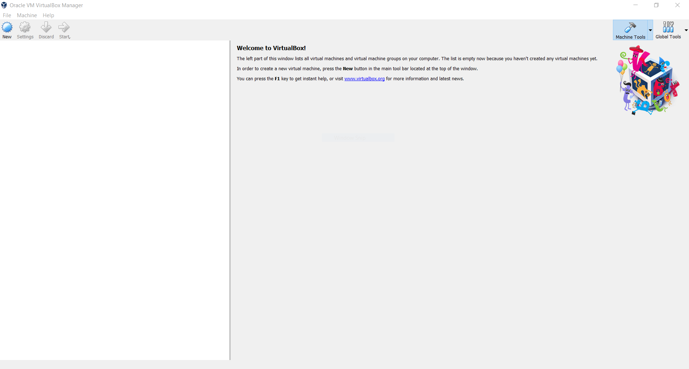
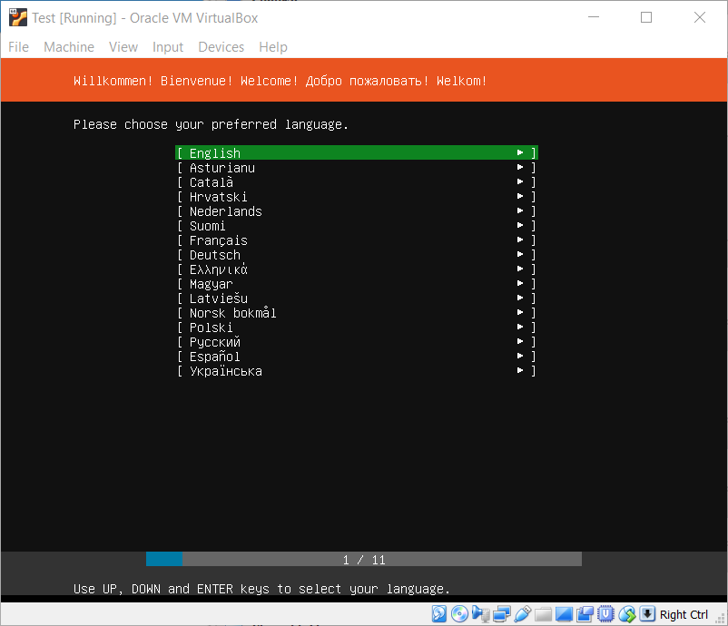
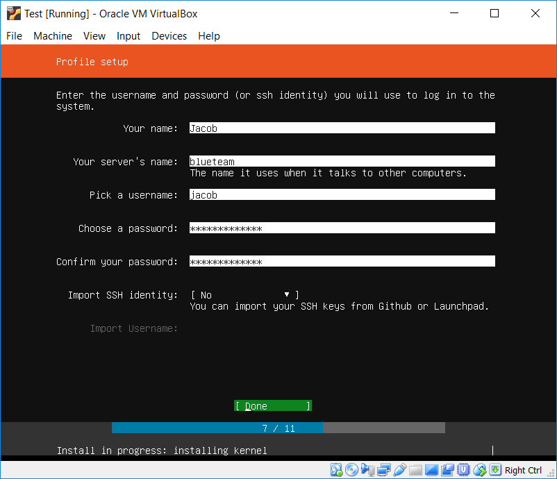
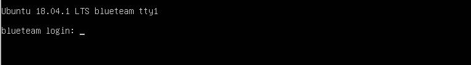
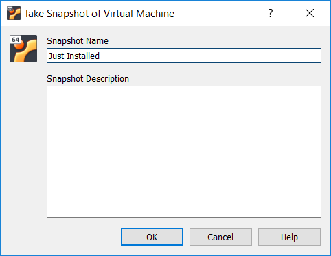
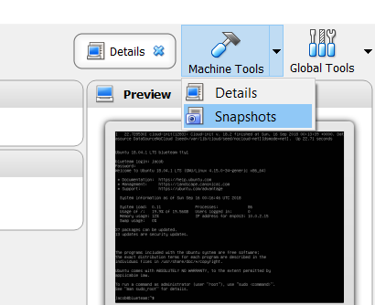
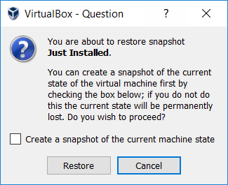

# Assumptions

This page assumes:
* You're on Windows. (If you're on Linux, install VirtualBox with your package manager and install the server, we'll need it later)

# What are Virtual Machines

Virtual machines are essentially virtual systems with real operating systems running inside another system. VirtualBox is a *hypervisor* which allows us to do this. Virtual Machines (or VMs) are everywhere in cybersecurity and IT these days, so it's something you'll really want to get familiar with. We'll be using VMs to create a small number of interconnected VMs that can talk with each other.

# Installing VirtualBox. 

The wizard is pretty straight forward, just take the defaults and be sure to accept the installation of the drivers.

# Getting an ISO

The ISO file is used as a virtual CD disk with ou virtual machine. We'll be using **Ubuntu 18.04**, which you can get here: [http://releases.ubuntu.com/18.04/ubuntu-18.04.1-live-server-amd64.iso](http://releases.ubuntu.com/18.04/ubuntu-18.04.1-live-server-amd64.iso)

# Create a virtual machine

Open VirtualBox. You should see something like this:

On the the main interface on the left, will be a list of virtual machines (VMs) once we create one. The right panel will give details on a VM when one is selected on the left.

To create a VM select the "New" button on the top left.

1. The wizard will prompt you for a name and operating system type. Make the name whatever you want, but set the Type to "Linux" and keep the default "Ubuntu (64-bit)".

2. On the next screen, keep it at the default 1024 MB.

3. On the next screen, keep the default (Create a virtual hard disk now) and just press Create.

4. On the Hard disk file type screen, keep the default VDA setting.

5. On the next screen, keep the default "Dynamically allocated"

6. On the next screen, set the size to 20 GB, then click "Create"

Now the VM is created, select it on the left and click the "Details" button on the right. These are your VMs details. 

To start the VM, press the "Start" button. A window should appear. A prompt will pup up asking for a start-up disk. The virtual hard disk we created has no OS, so we must install it ourselves. 

Click the folder icon next to the dropdown and browser to where the ISO is located, select it and press "Open." Then press start.

# Installing Ubuntu Server

After some text scrolls down the screen, you should eventually come to a prompt to choose your language. Welcome to the Ubuntu install wizard!

1. English is the default language. We'll be doing this tutorial in English, so please press Enter.
2. Set your keyboard. Just press Enter.
3. On the next screen, select "Install Ubuntu" with the arrow keys. When selected, press enter.
4. On the next screen, press Enter
5. On the screen for proxu info, press enter.
6. On the mirror address screen, press enter.
7. On the next screen, select "Use An Entire Disk" using the arrow keys. Then press enter.
8. On the next screen, the disk we created earlier is the default, press enter.
9. On the next screen, press enter to select Done.
10. A warning prompt will appear, ask us to "Confirm destructive action." With the arrow keys, press down to select "Continue." Press enter
11. On the next screen, you'll set up your username and password. Use the arrow keys to move between text boxes. When done, press down until Done is selected, then press Enter.

12. On the next screen with the list of "snaps," press Tab to drop down to the "Done" button. Press enter.
13. On the "Finished install!" screen, select "Reboot now." The VM will reboot. When prompted to remove installation media, just press enter VirtualBox automatically takes care of this for us.

# Using Ubuntu

The reboot is complete and the system is running, when only a login prompt is present. If stuff about SSH keys pop up, ignore it. Press enter to get a new prompt.

Login using the username and password you set before. Congrats! Ubuntu server is installed. Ubuntu server does NOT have a GUI like Windows. It's meant to be a server accessed remotely. We're mainly using it because part of this guide is to learn to use one of the most powerful parts of Linux, the command line.

# Snapshots

## Taking a Snapshot

VirtualBox supports snapshots, which stores the memory and disk at a certain point in time. It's essentially a back-in-time action for a VM. (Creating a snapshot does require a little more space on disk, so be careful.) Just in case we mess up somewhere, or want to try something different with our VM, we should take a snapshot now.

Do this by selecting on the window for the VM `Machine > Take Snapshot`. Name the snapshot something like "First" or "Initial" or "Just Installed" and press `Okay`.

## Reverting (Going back) to a Snapshot

To go back to the snapshot and restore a VM to the state of the snapshot, first make sure the VM is shut off. THis can be done with:
* `sudo poweroff`, type in your password and press enter. This is the recommended method.
* Right click the VM in the main window, and select `Close > Power Off` and then pressing `Power Off`. This is not recommended, as this is essentially pulling the plug on a phyiscal machine.

After the VM is shut off, go to the main screen and click the arrow next to the `Machine Tools` button. This will have the options `Details` and `Snapshots`. Select `Snapshots`. 

This will show a list of snapshots in a tree format. (This is because you can take snapshots after snapshots, and then go back and start a new tree of snapshots from a past point.) Select snapshot you made, then press `Restore`, This the window, you save the current state as a new snapshot by having the "Create a snapshot of the current machine state selected," otherwise, unselect it. Then press "Restore."

|         |  Navigation  |   |
| :-------------: |:-------------:| -----:|
| [< Ch 0](Chapter1-WhatsBlueTeaming)  | [Home](index) | [Ch 2 >](Chapter2-LinuxBasics)  |


