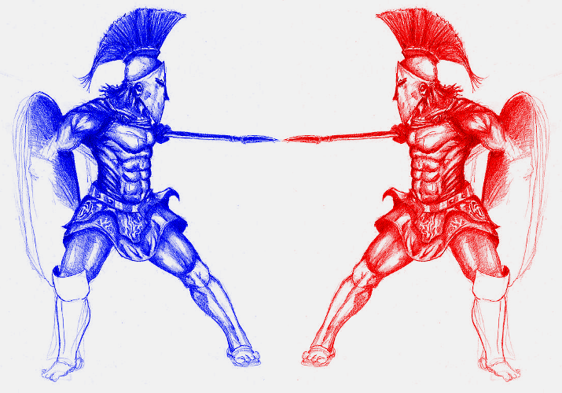

# Blue Team Crash Course

This repo contains a growing tutorial/guide for college-level blue teaming.

* [Chapter 0 - What's Blue Teaming?](Chapter0-WhatsBlueTeaming) - What's this all about?
* [Chapter 1 - Getting Started](Chapter1-GettingStarted) - Using Virtualbox and installing Linux.
* [Chapter 2 - Linux Basics](Chapter2-LinuxBasics) - Using Linux.
* [Chapter 3 - Networking Basics](Chapter3-NetworkingBasics) - Some networking basics.
* [Chapter 4 - More Networking](Chapter4-MoreNetworking) - More networking stuff.

[Credits](credits)